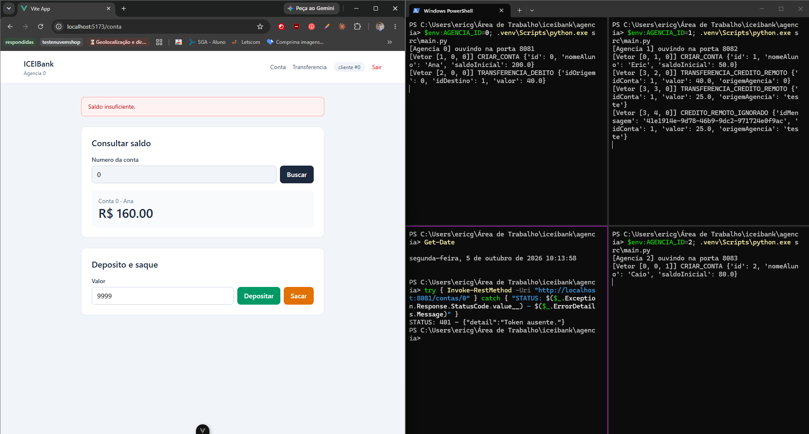
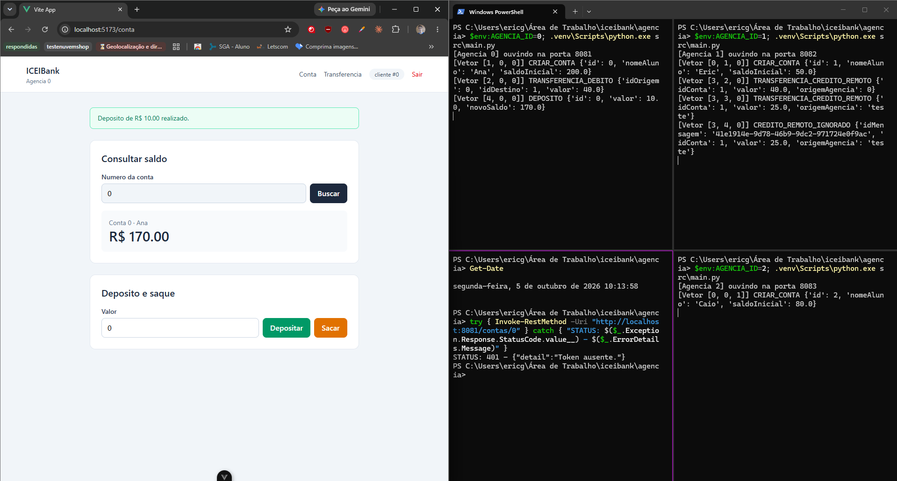

# RESPOSTAS (ICEIBank - Sprint 2)

## Parte B (Relógio vetorial)

1. **Com 3 agências, o vetor tem 3 posições. Se o sistema crescesse para 10 agências, o que aconteceria com o tamanho de cada vetor anexado a cada mensagem? Isso é um problema? Por quê (ou por que não)?**

   **Resposta:** O vetor passaria a ter 10 posições, e cada mensagem carregaria os 10 contadores. O tamanho cresce junto com o número de processos, não com o número de mensagens.

   Para 10 agências isso não é problema: são 10 inteiros por mensagem, nada perto do tamanho do resto do corpo. Vira problema com milhares de processos, porque cada mensagem passa a carregar um vetor enorme, na maior parte zerado.

   Tem também uma limitação de estrutura: cada agência precisa saber quantas agências existem e qual posição é de quem. No meu código isso é fixo, `RelogioVetorial(id_agencia, config.NUMERO_AGENCIAS)`. Adicionar uma agência nova exige mudar a configuração de todas.

2. **Dado `V1 = [3, 1, 0]` e `V2 = [3, 2, 0]`: qual evento aconteceu primeiro, ou eles são concorrentes?**

   **Resposta:** V1 aconteceu antes de V2.

   Comparando posição a posição: na primeira, 3 e 3, iguais. Na segunda, 1 e 2, V2 maior. Na terceira, 0 e 0, iguais. V1 é menor ou igual a V2 em todas as posições, e os dois não são idênticos. Então tudo que V1 conhecia, V2 também conhecia, e mais um evento da agência 1.

3. **Dado `V1 = [3, 1, 0]` e `V2 = [1, 3, 0]`: qual evento aconteceu primeiro, ou eles são concorrentes?**

   **Resposta:** São concorrentes.

   Na primeira posição V1 é maior (3 contra 1). Na segunda, V2 é maior (1 contra 3). Nenhum dos dois é menor ou igual ao outro em todas as posições. Cada um viu eventos que o outro não viu, então nenhum pode ter causado o outro.

## Parte C (Publish/Subscribe entre agências)

1. **No passo 4 da tarefa, o que aconteceu exatamente quando a Agência 1 voltou? Se a mensagem "sumiu" (não foi aplicada), isso foi porque a mensageria falhou, ou por outro motivo?**

   **Resposta:** A mensagem foi entregue. Com a agência 1 fora do ar, a transferência de 30 respondeu normalmente e o RabbitMQ Manager mostrou a `fila-agencia-1` com 1 mensagem pronta, esperando consumidor. Assim que a agência 1 subiu de novo, consumiu essa mensagem e registrou:

   ```
   [Vetor [5, 1, 0]] CREDITO_REMOTO_FALHOU {'idConta': 1, 'valor': 30.0, 'origemAgencia': 0, 'motivo': 'conta nao encontrada'}
   ```

   Então a mensageria fez a parte dela. O que falhou foi a memória da agência: as contas ficam num dicionário em memória, e quando o processo morreu a conta 1 morreu junto. A mensagem chegou e não tinha onde creditar.

   O próprio vetor mostra isso. A posição 1 está em 1, não em 3 como estava antes da queda: a agência 1 recomeçou do zero, sem lembrar de nada. Só a posição 0 veio da mensagem.

   Agência 1 fora do ar, transferência publicada mesmo assim:

   

   Mensagem retida na `fila-agencia-1` enquanto ninguém consumia:

   

   Agência 1 de volta, consumindo a mensagem e sem a conta para creditar:

   

2. **Compare esse comportamento com o do Sprint 1 (chamada REST direta): o que melhorou com a mensageria, e o que continua sendo um problema em aberto?**

   **Resposta:** No Sprint 1, com a agência de destino fora do ar, a chamada falhava na hora com 502 e o crédito nunca mais era tentado. Agora a mensagem fica guardada no broker e é entregue quando a agência volta. A origem também não depende mais do destino estar no ar para concluir a parte dela.

   O que continua em aberto é que o resultado final ficou errado do mesmo jeito. A Ana perdeu 30 e ninguém recebeu, igual acontecia antes. A diferença é que antes a mensagem se perdia e agora ela chega, mas chegar não basta: o sistema só está correto se o crédito for aplicado.

   Além disso, a resposta mudou de sentido. Antes, sucesso significava "o crédito foi aplicado". Agora significa só "a mensagem foi publicada", e a origem não fica sabendo que o crédito falhou do outro lado. O `CREDITO_REMOTO_FALHOU` só aparece no log da agência 1.

3. **O consumidor de mensagens (`assinar`) processa créditos sem passar por nenhuma verificação de token JWT. Isso é um problema de segurança?**

   **Resposta:** No meu ambiente de hoje, não é um problema grave, porque só consegue publicar na exchange quem tem a URL do CloudAMQP, que já carrega usuário e senha. Essa URL fica no `agencia/.env`, que está no `.gitignore`. O controle de acesso saiu do JWT e foi para a credencial do broker.

   Mas o controle é fraco em um ponto: as três agências usam a mesma credencial, e a mensagem não carrega nada que prove quem mandou. Quem tiver a URL consegue publicar um crédito de qualquer valor, para qualquer conta, fingindo ser qualquer agência, sem débito nenhum do outro lado. Isso quase aconteceu na prática: durante a configuração a URL completa apareceu num print, e rotacionei a senha logo em seguida.

   No Sprint 1 eu tinha resolvido esse mesmo problema com um token de serviço próprio, aceito só pela rota `creditar-remoto`. Com a rota removida, esse token ficou sem uso e apaguei o `exige_servico()` do `auth.py`.

**Evidências da Parte C**

Transferência entre agências completando pela mensageria, com o log das duas agências:


Regressão depois da troca de REST por mensageria: depósito pelo frontend logado como cliente, o mesmo depósito no log da agência 0, e token vencido ainda sendo recusado.


Depois de separar o backend em services e repositories, repeti a regressão: rota sem token recusada com 401, saque acima do saldo recusado na tela sem virar evento no log, e depósito aplicado com o vetor avançando.





## Parte D (Linha do tempo causal)

1. **No Sprint 1, o relógio de Lamport não permitia essa análise. O que exatamente, no relógio vetorial, torna possível essa comparação confiável?**

   **Resposta:** O vetor guarda quanto cada evento sabia de cada agência, posição por posição. O Lamport junta tudo num número só e perde essa informação: dois números diferentes não dizem se um evento conhecia o outro.

   Com o vetor, a comparação vira uma checagem direta. Se V1 é menor ou igual a V2 em todas as posições, tudo que V1 conhecia V2 também conhecia, então V1 veio antes. Se cada um é maior em alguma posição, cada um viu algo que o outro não viu, e nenhum pode ter causado o outro. É isso que `comparar_vetores()` faz no `mesclar_logs.py`.

   Isso só funciona porque a regra 3 propaga o conhecimento: ao receber uma mensagem, a agência fica com o máximo de cada posição. Então o crédito remoto sempre carrega tudo o que o débito sabia, e nunca sai como concorrente dele.

2. **Encontre, no seu próprio teste, um par de eventos que o script classificou como concorrente. Faz sentido? Explique por que eles realmente não têm relação de causa e efeito entre si.**

   **Resposta:** No meu teste criei uma conta em cada agência e fiz uma transferência da agência 0 para a 1. O script listou 6 pares concorrentes. Um deles:

   ```
   [agencia-2] CRIAR_CONTA ([0, 0, 1])  x  [agencia-1] TRANSFERENCIA_CREDITO_REMOTO ([3, 2, 0])
   ```

   Faz sentido. A agência 2 só criou a conta do Caio e nunca trocou mensagem com ninguém. O crédito na agência 1 veio da transferência da agência 0, que também não sabia nada da agência 2. O vetor mostra isso: o crédito tem 0 na posição 2, e a criação da conta tem 0 nas posições 0 e 1. Cada um ignora o outro.

   O par que não apareceu também diz muito. O débito `[2, 0, 0]` e o crédito `[3, 2, 0]` são de agências diferentes, mas o débito é menor ou igual em todas as posições, então o script classificou como causal e não listou. É a transferência: o débito causou o crédito.

   

3. **O algoritmo de comparação de vetores neste script é O(n²) no número de eventos. Isso seria um problema em um sistema real com milhões de eventos? O que se poderia fazer para tornar essa análise mais escalável?**

   **Resposta:** Seria. Com um milhão de eventos são cerca de 500 bilhões de comparações, cada uma percorrendo o vetor inteiro. Com os poucos eventos do meu teste isso roda na hora, mas não escala.

   Dá para reduzir bastante sem mudar a ideia:

   - Analisar uma janela de tempo em vez do histórico todo, aceitando não olhar pares muito distantes.
   - Comparar só os eventos que interessam, como os da mesma conta. O script já pula pares da mesma agência, que são sempre causais.
   - Processar em fluxo: cada evento novo é comparado só com os eventos recentes das outras agências, em vez de reprocessar tudo a cada execução.

## Funcionalidade adicional (seção 2.1)

**Funcionalidade escolhida: idempotência no consumidor de créditos**

No Sprint 1 tornei a transferência idempotente na origem, para um clique duplo não debitar duas vezes. Com a mensageria apareceu o mesmo problema do outro lado. O RabbitMQ garante entrega "pelo menos uma vez": se a agência de destino processa a mensagem e cai antes de confirmar (o ack), o broker entrega a mesma mensagem de novo. Sem nenhuma proteção, a conta de destino recebia o crédito duas vezes, e o dinheiro aparecia do nada.

Escolhi essa porque fecha um furo real da troca de REST por mensageria, e porque continua a ideia que eu já tinha começado no Sprint 1.

**O que ela faz.** Cada mensagem de crédito passou a levar um `idMensagem`, gerado com `uuid4()` na hora da publicação. A agência de destino guarda os ids que já aplicou no `TransferenciasRepository`. Se chegar uma mensagem com um id repetido, ela não credita de novo e registra o evento `CREDITO_REMOTO_IGNORADO` no log.

O id só é guardado depois que o crédito é aplicado. Se a conta não existir, a mensagem não entra na lista, então uma nova entrega ainda pode ser aplicada se a conta for criada.

Mensagens sem `idMensagem`, como as que ficaram retidas na fila antes desta mudança, continuam sendo aplicadas normalmente.

**Teste.** Criei o script `agencia/scripts/testar_idempotencia.py`, que simula a falha do ack publicando a mesma mensagem de crédito duas vezes na fila da agência dona da conta.

Rodei `scripts/testar_idempotencia.py 1 25` com as agências no ar. As duas entregas saíram com o mesmo `idMensagem`, e a agência 1 aplicou só a primeira:

```
[Vetor [3, 3, 0]] TRANSFERENCIA_CREDITO_REMOTO {'idConta': 1, 'valor': 25.0, 'origemAgencia': 'teste'}
[Vetor [3, 4, 0]] CREDITO_REMOTO_IGNORADO {'idMensagem': '41e1914e-...', 'idConta': 1, 'valor': 25.0, ...}
```

O saldo do Eric foi de 90 para 115, não para 140.


**Limite conhecido.** Igual ao Sprint 1, os ids ficam em memória e somem se a agência reiniciar.
