# RESPOSTAS (ICEIBank - Sprint 1)

## Parte B (Relógio de Lamport e registro de eventos)

1. **Por que o relógio de Lamport usa `max(contador_local, timestampRecebido) + 1` ao receber uma mensagem, em vez de simplesmente adotar o timestamp recebido diretamente?**

   **Resposta:** A regra existe para o contador ficar **sempre maior que os dois valores** (o local e o recebido), e cada metade da fórmula resolve um problema.

   O `max` impede que o contador **retroceda**: se a agência está em 10 e recebe 3, adotar o 3 faria eventos futuros dela receberem timestamps menores que eventos que ela já registrou, quebrando a ordem dos seus próprios eventos.

   O `+ 1` garante que o recebimento seja **estritamente posterior** ao envio. Sem ele, envio e recebimento ficariam com o mesmo timestamp e a relação *happened-before* entre os dois sumiria do relógio. É isso que sustenta a ordem parcial de causa e efeito: se A aconteceu antes de B causalmente, então `timestamp(A) < timestamp(B)`.

   No código, é o `ao_receber` de `relogio_lamport.py`, usado pela agência de destino quando recebe um crédito remoto de outra agência.

2. **Se a Agência 0 está no evento de contador 10 e recebe uma mensagem com timestamp 3 (de uma agência mais "atrasada"), qual o novo valor do contador da Agência 0? O que isso implica sobre agências que processam muitos eventos rapidamente versus agências mais lentas?**

   **Resposta:** `max(10, 3) + 1 = 11`. A mensagem atrasada não puxa a Agência 0 pra trás, ela só avança 1, como em qualquer evento local.

   Isso significa que o ajuste só acontece **para cima**: a agência lenta salta pra frente ao receber mensagem de uma rápida, mas a rápida nunca é freada pela lenta. Como cada uma conta só os próprios eventos, duas agências rodando ao mesmo tempo podem ter contadores bem diferentes.

   Ou seja, o contador não mede tempo real nem quantidade de trabalho, ele só garante a ordem de causa e efeito entre eventos que se comunicaram.

## Parte D (Transferências)

1. **No trecho `agenciaDestino === idAgencia`, por que a transferência local não precisa da lógica de `aoEnviar()`/`aoReceber()` do relógio de Lamport, enquanto a transferência entre agências precisa?**

   **Resposta:** Porque as regras 2 e 3 do Lamport existem só para sincronizar relógios de processos diferentes. Na transferência local não há mensagem nenhuma: débito e crédito acontecem no mesmo processo, no mesmo relógio, então dois `evento_local()` seguidos já deixam a ordem correta. É o que aparece no log da transferência local:

   ```
   [Lamport 3] TRANSFERENCIA_DEBITO  {idOrigem: 0, idDestino: 3}
   [Lamport 4] TRANSFERENCIA_CREDITO {idOrigem: 0, idDestino: 3}
   ```

   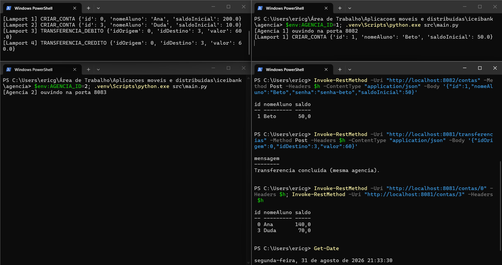

   Já entre agências existem dois relógios independentes que nunca se falaram. A origem usa `ao_enviar()` e manda o valor junto da requisição; o destino usa `ao_receber(ts)` = `max(local, recebido) + 1`. Sem isso, a agência de destino registraria o crédito com um número baseado só no próprio histórico, e o crédito poderia acabar com timestamp menor que o débito que o causou. No teste, a agência 1 estava em 1 e recebeu 6, virando `max(1, 6) + 1 = 7`:

   ```
   agencia-0: [Lamport 5] TRANSFERENCIA_DEBITO          (envio saiu com 6)
   agencia-1: [Lamport 7] TRANSFERENCIA_CREDITO_REMOTO
   ```

   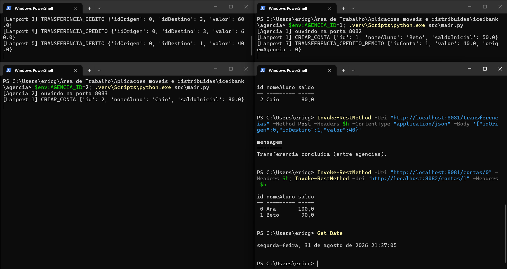

2. **Reproduza a falha conhecida e observe o saldo da conta de origem depois do erro. Ele foi revertido? O que isso significa em termos de consistência do sistema bancário?**

   **Resposta:** Não foi revertido. Com a agência 1 derrubada, a transferência de 30 respondeu 502 e o saldo da conta 0 caiu de 100 para 70, ficando assim. O log registrou o débito e, logo depois, a falha:

   ```
   [Lamport 7] TRANSFERENCIA_DEBITO  {idOrigem: 0, idDestino: 1, valor: 30.0}
   [Lamport 9] TRANSFERENCIA_FALHOU  {erro: "... [WinError 10061] ..."}
   ```

   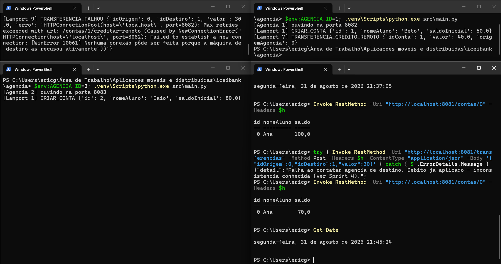

   Em termos de consistência, o sistema ficou num estado inválido: os 30 saíram da conta de origem e não entraram em lugar nenhum. Somando o dinheiro de todas as agências, o total do banco diminuiu sem que ninguém tenha sacado. A operação deveria ser atômica (ou acontece inteira, ou não acontece), mas aqui ela é composta por duas etapas independentes, em máquinas diferentes, e só a primeira foi aplicada. O sistema sabe que isso aconteceu, já que registrou `TRANSFERENCIA_FALHOU`, mas não tem nenhum mecanismo para desfazer o débito.

3. **Pensando à frente para o Sprint 4: cite, em alto nível, duas formas possíveis de corrigir esse problema.**

   **Resposta:** A primeira é o **commit em duas fases (2PC)**: antes de aplicar qualquer coisa, um coordenador pergunta às duas agências se elas conseguem executar a operação e as duas reservam os recursos sem confirmar; só se ambas responderem que sim é que o coordenador manda confirmar. Se qualquer uma falhar, todas desfazem a reserva. A vantagem é a atomicidade real; a desvantagem é que as contas ficam bloqueadas durante a espera, e se o coordenador cair no meio o sistema trava.

   A segunda é a **Saga com transação compensatória**: cada etapa é aplicada e confirmada na hora, mas para cada uma existe uma operação inversa registrada. Se o crédito na agência de destino falhar, a agência de origem executa a compensação (um estorno que devolve os 30 à conta) em vez de tentar desfazer a transação. Não há bloqueio, mas existe uma janela em que o saldo fica temporariamente inconsistente até a compensação rodar.

## Parte E (Linha do tempo unificada)

**Observação do passo 3 da tarefa (eventos com mesmo timestamp, comparação com `horaParede`)**

Na linha do tempo gerada apareceram dois casos de empate:

```
[Lamport 1] (00:28:46) agencia-0 - CRIAR_CONTA {"id": 0, "nomeAluno": "Ana"}
[Lamport 1] (00:29:56) agencia-1 - CRIAR_CONTA {"id": 1, "nomeAluno": "Beto"}
[Lamport 1] (00:36:30) agencia-2 - CRIAR_CONTA {"id": 2, "nomeAluno": "Caio"}

[Lamport 7] (00:44:57) agencia-0 - TRANSFERENCIA_DEBITO
[Lamport 7] (00:36:43) agencia-1 - TRANSFERENCIA_CREDITO_REMOTO
```

Nos dois casos os eventos são **concorrentes**, não causais. As três criações de conta empatadas em 1 são o primeiro evento de cada agência, e nenhuma agência tinha se comunicado com as outras até ali. No empate em 7, o crédito remoto da agência 1 foi causado pelo débito de timestamp 5 da agência 0 (que enviou a mensagem com timestamp 6, virando `max(1, 6) + 1 = 7` no destino), enquanto o débito de timestamp 7 da agência 0 é uma operação local posterior e sem relação com aquele crédito.

A ordem por `horaParede` **não bate** com a ordem por Lamport. O caso mais claro é este:

```
[Lamport 1] (00:36:30) agencia-2 - CRIAR_CONTA
[Lamport 2] (00:28:54) agencia-0 - CRIAR_CONTA
```

O evento de timestamp 2 aconteceu quase 8 minutos **antes** do evento de timestamp 1, mas aparece depois na lista ordenada por Lamport. Isso confirma que o relógio lógico não tenta representar tempo real: ele só garante a ordem entre eventos que realmente têm relação causal.

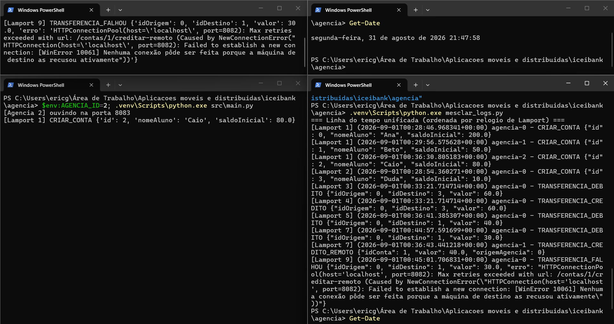

1. **O relógio de Lamport garante que, se A aconteceu antes de B causalmente, `timestamp(A) < timestamp(B)`. Ele não garante a volta. O que isso significa na prática quando você vê dois eventos com timestamps diferentes na linha do tempo, mas sem saber se um realmente influenciou o outro?**

   **Resposta:** Significa que `timestamp(A) < timestamp(B)` não permite concluir que A causou B. A garantia vale só num sentido: se houve causalidade, os timestamps estão em ordem; mas timestamps em ordem podem ser apenas coincidência entre eventos independentes.

   Na linha do tempo isso aparece direto: o `CRIAR_CONTA` da agência 2 (timestamp 1) e o da agência 0 (timestamp 2) estão "em ordem" no relógio lógico, mas são eventos totalmente independentes, feitos em máquinas diferentes com 8 minutos de diferença. Olhando só os números, não dá pra saber se um influenciou o outro ou se não têm relação nenhuma.

2. **O relógio de Lamport, sozinho, seria suficiente para um sistema que precisa distinguir com certeza "A e B são concorrentes" de "A aconteceu antes de B"? Por que isso motiva o relógio vetorial do Sprint 2?**

   **Resposta:** Não seria suficiente. Como o Lamport resume tudo em um único número por processo, ele perde a informação de quais eventos cada processo já conhecia. Dois eventos com o mesmo timestamp podem ser concorrentes, e dois com timestamps diferentes também podem ser, sem que o número diga qual é o caso.

   O relógio vetorial resolve isso guardando um contador para cada processo, não só um. Comparando os vetores dá pra decidir com certeza: se um vetor domina o outro em todas as posições, há causalidade; se nenhum domina, os eventos são concorrentes. É exatamente a distinção que faltou nos empates em timestamp 1 e 7 desta linha do tempo, e o motivo de o Sprint 2 substituir o Lamport pelo vetorial.

## Parte F (Autenticação JWT)

1. **Qual a diferença entre autenticação e autorização? Sua implementação verifica só uma das duas, ou as duas?**

   **Resposta:** Autenticação responde "quem é você" (o token é válido e não expirou); autorização responde "o que você pode fazer" (esse usuário tem permissão para esta operação específica).

   A implementação faz as duas, em funções separadas de `services/auth.py`:

   - `autenticado()` valida a assinatura e a expiração do token. Se falhar, retorna **401**.
   - `exige_dono()` compara o `sub` do token com o id da conta que está sendo operada. Se não for o dono nem o operador, retorna **403**.

   Um usuário autenticado **não** consegue sacar de uma conta que não é dele. No teste, o token válido da Ana (conta 0) foi recusado ao tentar acessar a conta 1: `403 - "Voce so pode operar a sua propria conta."`. O token estava correto, o que faltou foi permissão, e é justamente essa a diferença entre os dois conceitos.

   Existem ainda dois níveis acima do cliente: `exige_operador()`, para criar contas, e `exige_servico()`, para a rota interna entre agências.

   Sem token e com token inválido, 401:

   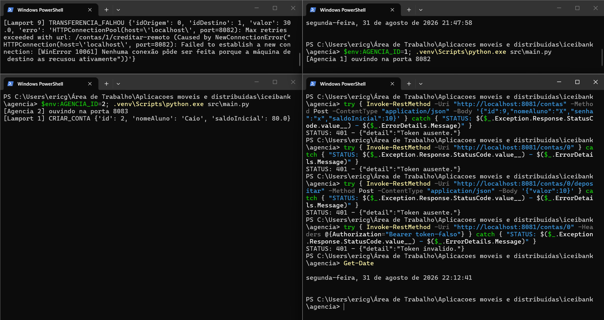

   Com token válido funciona, e acessar conta alheia dá 403:

   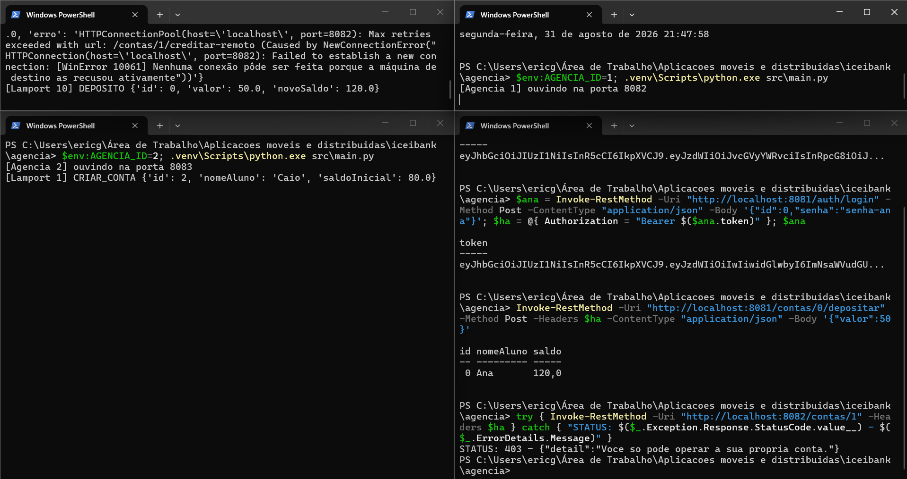

   Token expirado, 401:

   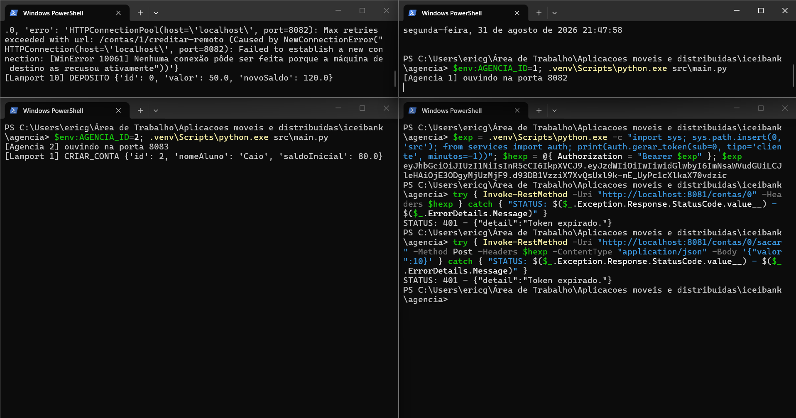

2. **Por que o servidor não precisa consultar um banco de dados para validar a assinatura de um JWT a cada requisição? O que isso implica sobre escalabilidade?**

   **Resposta:** Porque o token carrega os próprios dados (id do usuário, tipo, validade) e vem assinado com a chave secreta do servidor. Para validar, basta recalcular a assinatura com essa chave e comparar: se bater, o conteúdo não foi adulterado e é confiável. Toda a informação necessária está dentro do próprio token, nada precisa ser buscado fora.

   Em termos de escalabilidade, isso significa que o servidor não guarda estado de sessão. Com sessões em memória, cada requisição exigiria consultar onde a sessão está armazenada, e ao subir uma segunda instância do serviço a sessão criada numa instância não existiria na outra (seria preciso um Redis compartilhado ou fixar cada usuário numa instância). Com JWT, qualquer instância que conheça a chave secreta consegue validar qualquer token, então dá para escalar horizontalmente sem coordenação, o que é exatamente a situação das três agências deste projeto: cada uma valida sozinha os tokens que chegam.

   A contrapartida é que não existe forma simples de revogar um token antes da expiração: como nada é consultado, o servidor não tem onde marcar "este token não vale mais". É por isso que o tempo de expiração precisa ser curto.

3. **O que aconteceria com a segurança do sistema se a chave secreta usada para assinar o JWT vazasse?**

   **Resposta:** Quem tivesse a chave poderia forjar tokens válidos para qualquer identidade, sem precisar de senha nenhuma, já que a validação é puramente matemática e o servidor não consulta nada externo. Na prática, seria possível gerar um token de cliente para qualquer conta e movimentar o dinheiro dela, gerar um token de operador e criar contas, ou gerar um token de serviço e chamar `creditar-remoto` diretamente, creditando qualquer valor sem que exista débito correspondente em outra agência.

   Pior ainda: como o token forjado é indistinguível de um legítimo, o sistema não teria como detectar o ataque pelos logs, apenas pelo efeito (saldos inconsistentes). A única resposta real seria trocar a chave secreta, o que invalida de imediato todos os tokens em circulação e obriga todos os usuários a fazer login de novo.

   Por isso a chave é lida da variável de ambiente `JWT_SEGREDO` em `config.py`, em vez de ficar fixa no código, e o valor presente no repositório serve apenas para desenvolvimento.

**Decisões de design (formato das credenciais, expiração do token, tratamento da chamada `creditar-remoto` entre agências)**

**Formato das credenciais.** Criei dois perfis em vez de um usuário único:

- **Cliente**: login em `POST /auth/login` com o id da conta e a senha definida na criação. Token com `tipo: "cliente"` e `sub` igual ao id da conta.
- **Operador da agência**: login em `POST /auth/login-operador` com usuário e senha fixos em `config.py`. Token com `tipo: "operador"`.

Separei assim porque criar conta também exige token, e a credencial do cliente só existe depois que a conta foi criada. Sem o operador, não haveria como criar a primeira conta. Além de resolver esse impasse, o modelo fica mais próximo de um banco real, onde abrir conta é operação da instituição e não do correntista. E como o token do cliente carrega o id da conta, dá para implementar autorização de verdade em cima disso.

As senhas ficam guardadas com `sha256` e nunca aparecem nas respostas da API, porque `sem_senha()` remove o campo antes de devolver a conta.

**Expiração do token.** 30 minutos para cliente e operador. É suficiente para uma sessão de uso e curto o bastante para limitar o estrago se um token vazar, já que não existe forma de revogá-lo antes de expirar. O valor fica em `JWT_EXPIRACAO_MINUTOS`.

**Chamada `creditar-remoto` entre agências.** Escolhi exigir token, mas de um tipo próprio.

Deixar a rota aberta seria mais simples, mas qualquer um com acesso à rede poderia creditar o valor que quisesse em qualquer conta, sem débito nenhum do outro lado. Repassar o token do cliente também não resolve: ele é dono da conta de origem, não da de destino, e a agência que recebe estaria aceitando um token emitido para outra finalidade.

Então a agência de origem gera, na hora da chamada, um token com `tipo: "servico"` e validade de 1 minuto, assinado com a mesma chave que as agências compartilham. A rota `creditar-remoto` aceita só esse tipo, via `exige_servico`, o que deixa claro no próprio código que ela é interna e não um endpoint público. Testei os dois casos: com o token de cliente da Ana a resposta foi `403 - "Esta rota so aceita chamadas entre agencias."`, e sem token, `401`.

## Parte G (Frontend)

1. **Como o frontend "lembra" de reenviar o token em cada requisição depois do login?**

   **Resposta:** Por um interceptor de request do axios, em `services/api.ts`. Toda requisição passa por ele antes de sair, e ele faz duas coisas: define o `baseURL` para a agência escolhida no login e injeta o cabeçalho `Authorization: Bearer <token>`.

   O token em si vive na store do Pinia (`stores/auth.ts`), que lê o `localStorage` quando a aplicação carrega. Por isso a sessão sobrevive a um F5: o estado é recuperado do `localStorage`, não do zero.

   O ganho prático é que nenhuma tela monta cabeçalho na mão. `ContaView` chama `consultarSaldo(0)` e não sabe que existe token; quem cuida disso é uma camada só, num lugar só. Se eu precisasse trocar o esquema de autenticação, mexeria em um arquivo.

2. **Se o token expirar enquanto alguém está usando o frontend no meio de uma operação, o que acontece na sua implementação?**

   **Resposta:** Um interceptor de response captura o erro. Quando a resposta é 401, ele limpa a sessão (`sair()` apaga token, tipo e id da conta, tanto da store quanto do `localStorage`) e redireciona para `/login` levando junto a mensagem que o backend devolveu.

   Testei gerando um token com validade negativa e colocando ele no `localStorage` no lugar do válido. O console do navegador registra a resposta como `401 (Unauthorized)`, que é o nome do status HTTP, e no corpo vem o detalhe `Token expirado.`, que é o que a tela mostra numa faixa vermelha. A pessoa lê o motivo, não um erro genérico.

   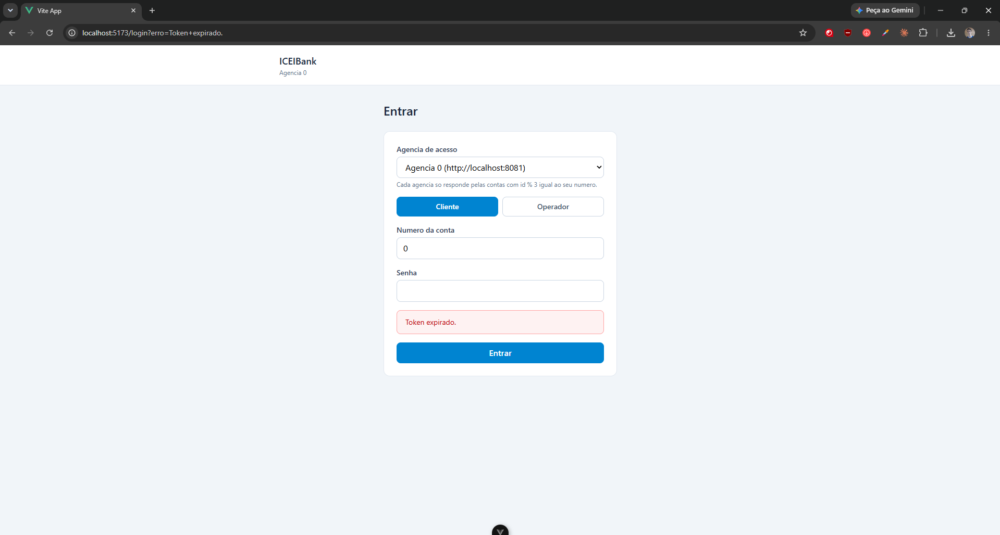

   Na primeira versão a mensagem se perdia. O interceptor gerava o texto certo, mas ir para `/login` monta o `LoginView` de novo, e o estado local dele nasce vazio, então a pessoa era expulsa da sessão sem explicação nenhuma e o 401 só aparecia no console do navegador. Descobri isso testando, não lendo o código. Corrigi passando a mensagem pela query da rota (`/login?erro=Token+expirado.`), que o `LoginView` lê ao montar. Escolhi a query justamente porque ela sobrevive à troca de tela e a um refresh, que era o ponto onde a mensagem morria.

3. **No seu frontend, onde fica o "M" (Model), o "V" (View) e o "C" (Controller)?**

   **Resposta:** Separei por pasta:

   - **Model**: `types/index.ts` (os tipos `Conta` e `RespostaLogin`, e a regra de partição `id % 3`), `services/api.ts` (todo o acesso à API) e `stores/auth.ts` (o estado da sessão).
   - **View**: `views/` e `components/`, ou seja, os blocos `<template>`. `AlertaMensagem` e `SeletorAgencia` são View reaproveitada em mais de uma tela.
   - **Controller**: o `<script setup>` de cada view. Em `ContaView.vue` são as funções `buscar()`, `operar()` e `abrirConta()`: recebem o evento do usuário, chamam o Model, guardam o resultado e decidem se mostram erro ou sucesso.

   O código não ficou tão separado quanto o padrão sugere, e acho que não deveria ficar. Em Vue o Controller não é uma camada com pasta própria: ele mora no mesmo arquivo da View, dentro do `<script setup>`, e parte dele escorre para a store. A separação existe por responsabilidade, não por arquivo.

**Decisões de design (escolha do framework, onde guardar o token)**

**Escolha do framework.** Vue 3 com Vite e TypeScript.

Escolhi Vue para já ir aprendendo o framework, porque vamos usar ele também no trabalho interdisciplinar.

**Onde guardar o token.** No `localStorage`, junto com o tipo de perfil, o id da conta e a agência escolhida.

Escolhi assim para a sessão sobreviver a um refresh. Guardar só na memória seria mais seguro, mas eu perderia o login a cada F5, e recarreguei a página o tempo todo testando.

O risco é que qualquer script rodando na página consegue ler o token. O que limita o estrago é a expiração de 30 minutos.

**Evidências do fluxo completo pela interface**

Login:

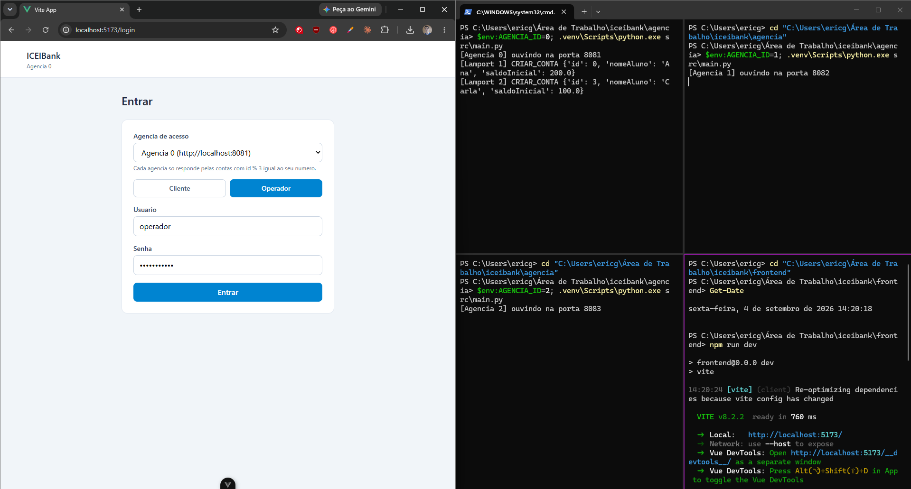

Agência recusando conta que não é dela:

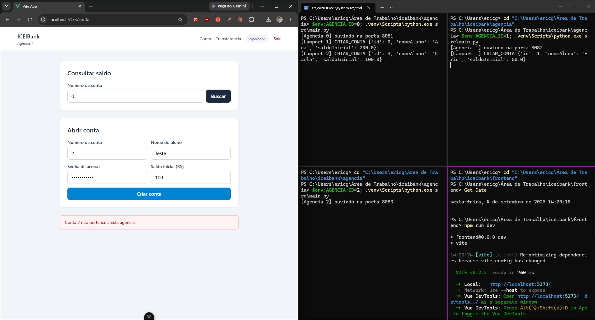

Depósito e saque:

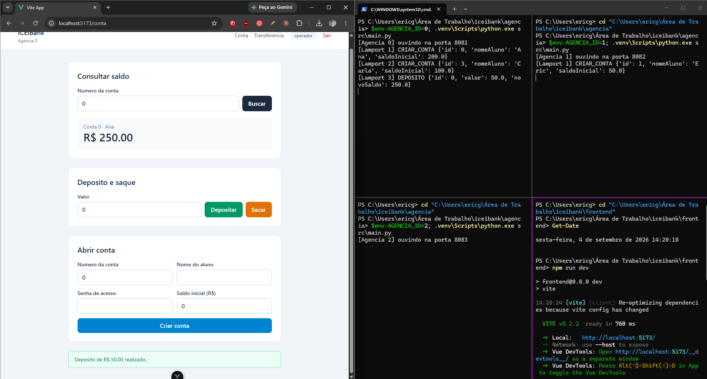

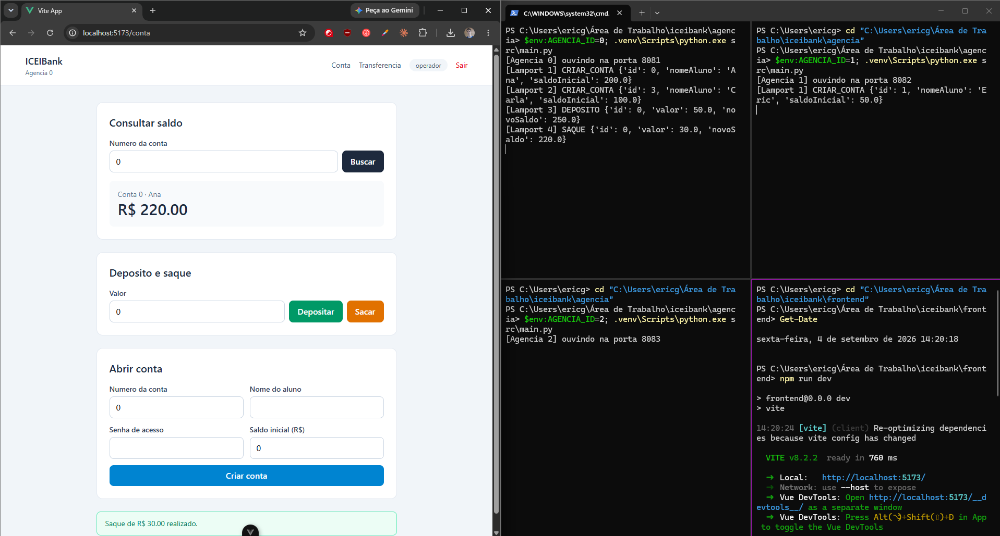

Transferência local e entre agências:

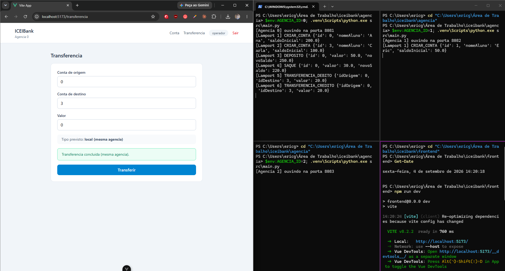

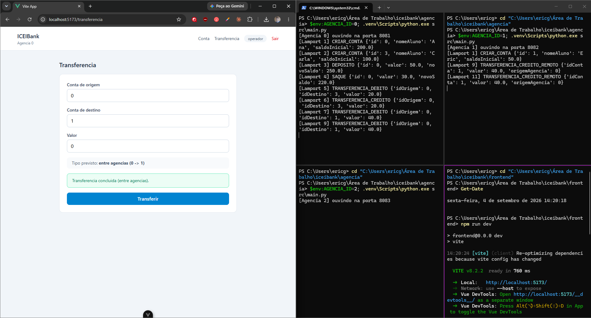

Erro visível na tela:

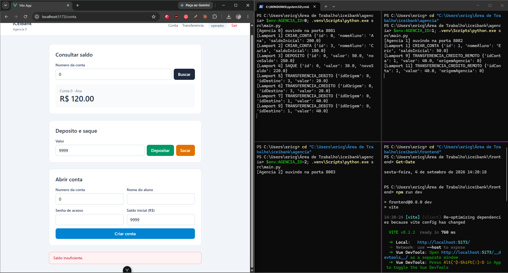

## Funcionalidade adicional (seção 2.1)

**Observação levantada durante os testes da Parte G**

Testando a transferência pela interface, cliquei duas vezes em **Transferir** sem querer. O sistema aplicou a transferência duas vezes: saíram R$ 80,00 da conta 0 em vez de R$ 40,00. O log da agência 0 mostra os dois débitos, e a agência 1 mostra os dois créditos correspondentes:

```
agencia-0: [Lamport 7] TRANSFERENCIA_DEBITO {idOrigem: 0, idDestino: 1, valor: 40.0}
agencia-0: [Lamport 9] TRANSFERENCIA_DEBITO {idOrigem: 0, idDestino: 1, valor: 40.0}
agencia-1: [Lamport 9]  TRANSFERENCIA_CREDITO_REMOTO {idConta: 1, valor: 40.0}
agencia-1: [Lamport 11] TRANSFERENCIA_CREDITO_REMOTO {idConta: 1, valor: 40.0}
```

Nada na transferência distingue a mesma operação chegando duas vezes de duas transferências iguais, então a agência aplicou as duas.

É a idempotência de transferências que o roteiro cita na seção 2.1: usar um identificador único por operação para evitar que a mesma transferência seja aplicada duas vezes se a requisição for reenviada.

**Funcionalidade escolhida: idempotência de transferências**

Escolhi essa porque o problema apareceu sozinho no meu próprio teste, então eu sabia exatamente o que precisava resolver.

**O que ela faz.** A transferência passou a aceitar um campo `idOperacao`, um identificador único daquela operação. A agência guarda os ids que já processou em `app.state.transferencias_aplicadas`. Se chegar uma requisição com um id repetido, ela devolve o resultado da primeira sem debitar de novo, e registra o evento `TRANSFERENCIA_IGNORADA` no log.

O id é gerado no frontend com `crypto.randomUUID()` quando a tela de transferência abre, e só é trocado depois de uma transferência dar certo. Isso é o que faz a coisa funcionar: dois cliques na mesma transferência mandam o mesmo id, enquanto duas transferências diferentes mandam ids diferentes.

O campo é opcional. Sem ele, a rota se comporta como antes, então as chamadas por `Invoke-RestMethod` que já estavam nas outras evidências continuam valendo.

**Teste.** Repeti o clique duplo que tinha causado o problema. Agora o segundo clique não debita nada, o saldo fica igual, e o log mostra a requisição repetida sendo recusada:

```
agencia-0: [Lamport 7] TRANSFERENCIA_DEBITO    {idOrigem: 0, idDestino: 1, valor: 40.0}
agencia-0: [Lamport 8] TRANSFERENCIA_IGNORADA  {idOperacao: "...", idOrigem: 0, idDestino: 1}
```

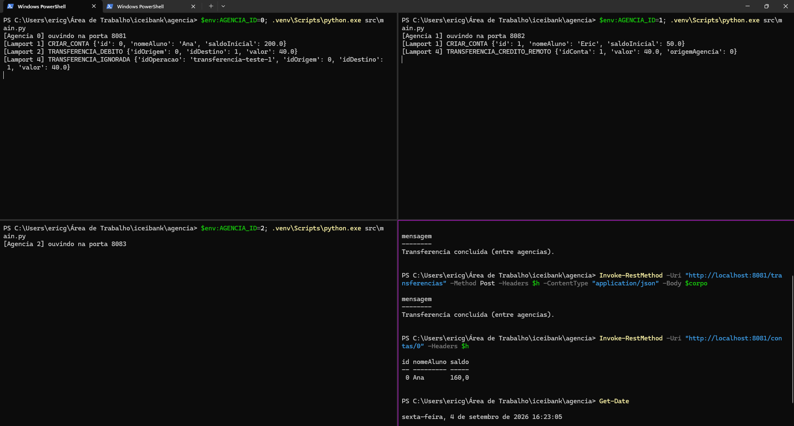

**Limite conhecido.** Os ids ficam em memória, junto com as contas, então somem se a agência reiniciar. Faz sentido no escopo deste sprint, que não tem banco de dados.

## Vídeo de apresentação

[`evidencias/videos/apresentacao-sprint1.mp4`](evidencias/videos/apresentacao-sprint1.mp4)

Percorre o sistema rodando e as decisões de projeto: partição das contas entre as três agências, relógio de Lamport nas três regras, transferência local e entre agências, autenticação com JWT, o frontend consumindo a API autenticada, a idempotência das transferências e a limitação conhecida sob falha.

---

# RESPOSTAS (ICEIBank - Sprint 2)

## Parte B (Relógio vetorial)

1. **Com 3 agências, o vetor tem 3 posições. Se o sistema crescesse para 10 agências, o que aconteceria com o tamanho de cada vetor anexado a cada mensagem? Isso é um problema? Por quê (ou por que não)?**

   **Resposta:** O vetor passaria a ter 10 posições, e cada mensagem carregaria os 10 contadores. O tamanho cresce junto com o número de processos, não com o número de mensagens.

   Para 10 agências isso não é problema: são 10 inteiros por mensagem, nada perto do tamanho do resto do corpo. Vira problema com milhares de processos, porque cada mensagem passa a carregar um vetor enorme, na maior parte zerado.

   Tem também uma limitação de estrutura: cada agência precisa saber quantas agências existem e qual posição é de quem. No meu código isso é fixo, `RelogioVetorial(id_agencia, config.NUMERO_AGENCIAS)`. Adicionar uma agência nova exige mudar a configuração de todas.

2. **Dado `V1 = [3, 1, 0]` e `V2 = [3, 2, 0]`: qual evento aconteceu primeiro, ou eles são concorrentes?**

   **Resposta:** V1 aconteceu antes de V2.

   Comparando posição a posição: na primeira, 3 e 3, iguais. Na segunda, 1 e 2, V2 maior. Na terceira, 0 e 0, iguais. V1 é menor ou igual a V2 em todas as posições, e os dois não são idênticos. Então tudo que V1 conhecia, V2 também conhecia, e mais um evento da agência 1.

3. **Dado `V1 = [3, 1, 0]` e `V2 = [1, 3, 0]`: qual evento aconteceu primeiro, ou eles são concorrentes?**

   **Resposta:** São concorrentes.

   Na primeira posição V1 é maior (3 contra 1). Na segunda, V2 é maior (1 contra 3). Nenhum dos dois é menor ou igual ao outro em todas as posições. Cada um viu eventos que o outro não viu, então nenhum pode ter causado o outro.

## Parte C (Publish/Subscribe entre agências)

1. **No passo 4 da tarefa, o que aconteceu exatamente quando a Agência 1 voltou? Se a mensagem "sumiu" (não foi aplicada), isso foi porque a mensageria falhou, ou por outro motivo?**

   **Resposta:** A mensagem foi entregue. Com a agência 1 fora do ar, a transferência de 30 respondeu normalmente e o RabbitMQ Manager mostrou a `fila-agencia-1` com 1 mensagem pronta, esperando consumidor. Assim que a agência 1 subiu de novo, consumiu essa mensagem e registrou:

   ```
   [Vetor [5, 1, 0]] CREDITO_REMOTO_FALHOU {'idConta': 1, 'valor': 30.0, 'origemAgencia': 0, 'motivo': 'conta nao encontrada'}
   ```

   Então a mensageria fez a parte dela. O que falhou foi a memória da agência: as contas ficam num dicionário em memória, e quando o processo morreu a conta 1 morreu junto. A mensagem chegou e não tinha onde creditar.

   O próprio vetor mostra isso. A posição 1 está em 1, não em 3 como estava antes da queda: a agência 1 recomeçou do zero, sem lembrar de nada. Só a posição 0 veio da mensagem.

   Agência 1 fora do ar, transferência publicada mesmo assim:

   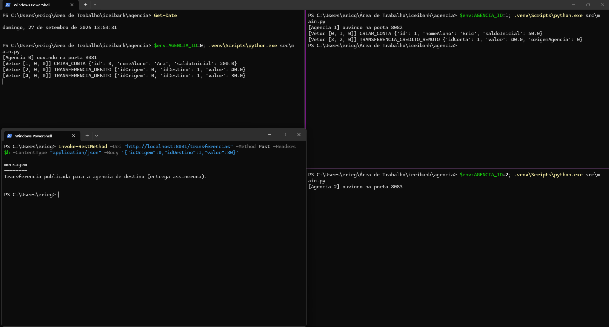

   Mensagem retida na `fila-agencia-1` enquanto ninguém consumia:

   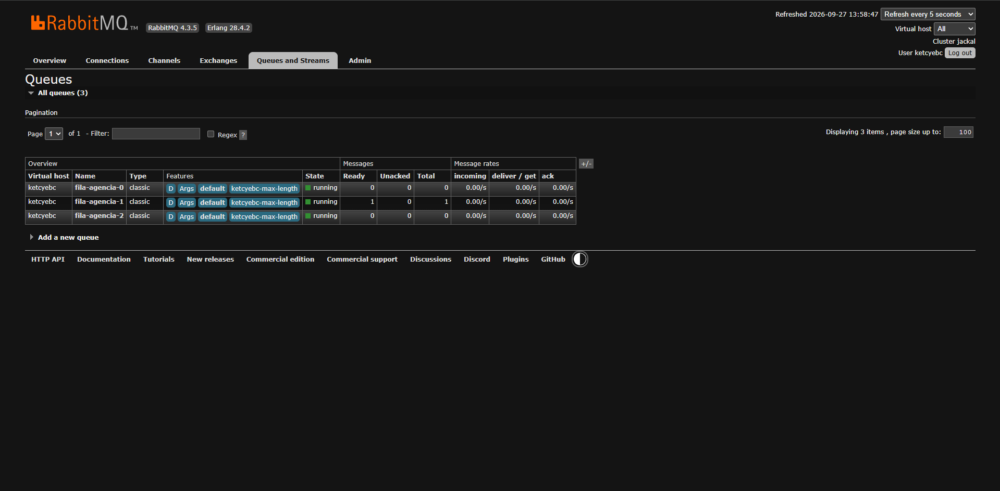

   Agência 1 de volta, consumindo a mensagem e sem a conta para creditar:

   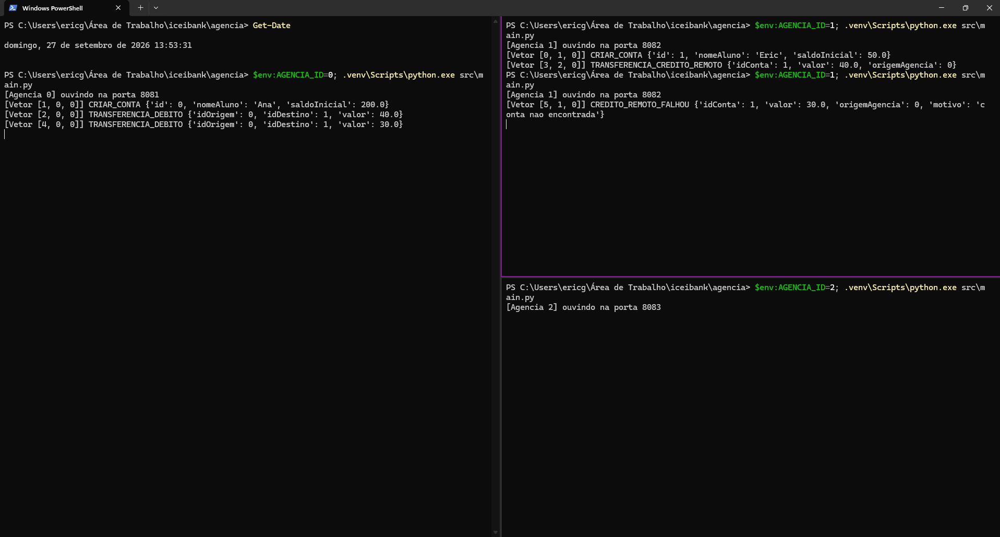

2. **Compare esse comportamento com o do Sprint 1 (chamada REST direta): o que melhorou com a mensageria, e o que continua sendo um problema em aberto?**

   **Resposta:** No Sprint 1, com a agência de destino fora do ar, a chamada falhava na hora com 502 e o crédito nunca mais era tentado. Agora a mensagem fica guardada no broker e é entregue quando a agência volta. A origem também não depende mais do destino estar no ar para concluir a parte dela.

   O que continua em aberto é que o resultado final ficou errado do mesmo jeito. A Ana perdeu 30 e ninguém recebeu, igual acontecia antes. A diferença é que antes a mensagem se perdia e agora ela chega, mas chegar não basta: o sistema só está correto se o crédito for aplicado.

   Além disso, a resposta mudou de sentido. Antes, sucesso significava "o crédito foi aplicado". Agora significa só "a mensagem foi publicada", e a origem não fica sabendo que o crédito falhou do outro lado. O `CREDITO_REMOTO_FALHOU` só aparece no log da agência 1.

3. **O consumidor de mensagens (`assinar`) processa créditos sem passar por nenhuma verificação de token JWT. Isso é um problema de segurança?**

   **Resposta:** No meu ambiente de hoje, não é um problema grave, porque só consegue publicar na exchange quem tem a URL do CloudAMQP, que já carrega usuário e senha. Essa URL fica no `agencia/.env`, que está no `.gitignore`. O controle de acesso saiu do JWT e foi para a credencial do broker.

   Mas o controle é fraco em um ponto: as três agências usam a mesma credencial, e a mensagem não carrega nada que prove quem mandou. Quem tiver a URL consegue publicar um crédito de qualquer valor, para qualquer conta, fingindo ser qualquer agência, sem débito nenhum do outro lado. Isso quase aconteceu na prática: durante a configuração a URL completa apareceu num print, e rotacionei a senha logo em seguida.

   No Sprint 1 eu tinha resolvido esse mesmo problema com um token de serviço próprio, aceito só pela rota `creditar-remoto`. Com a rota removida, esse token ficou sem uso e apaguei o `exige_servico()` do `auth.py`.

**Evidências da Parte C**

Transferência entre agências completando pela mensageria, com o log das duas agências:

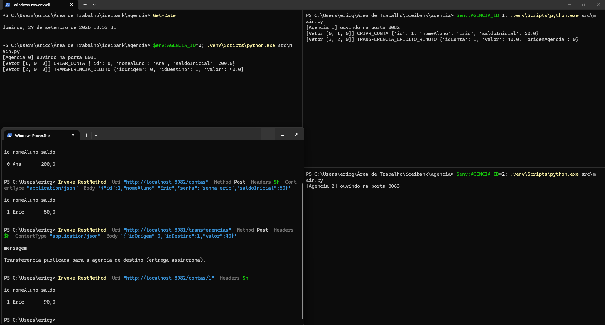

Regressão depois da troca de REST por mensageria: depósito pelo frontend logado como cliente, o mesmo depósito no log da agência 0, e token vencido ainda sendo recusado.

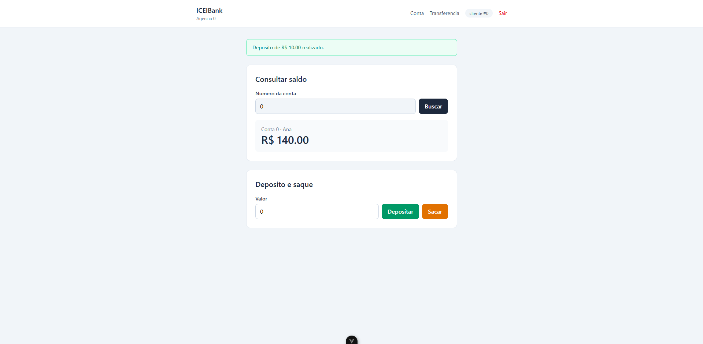

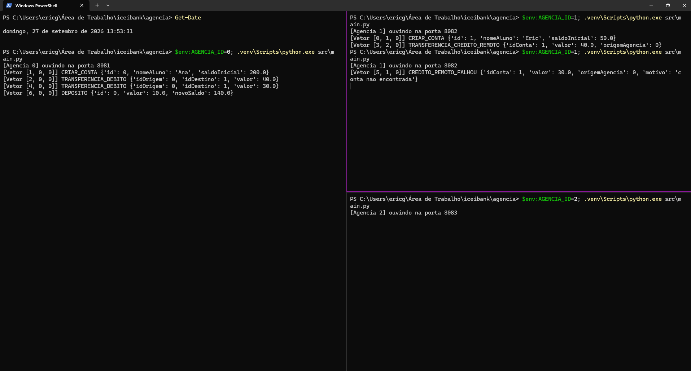

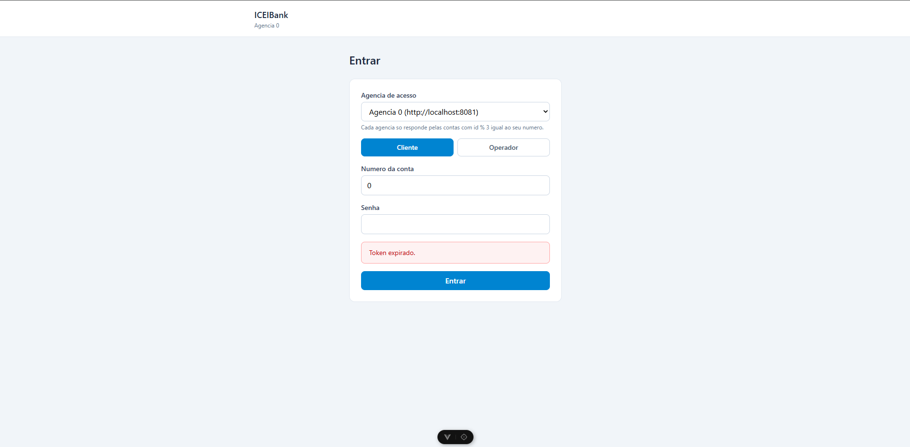

## Parte D (Linha do tempo causal)

1. **No Sprint 1, o relógio de Lamport não permitia essa análise. O que exatamente, no relógio vetorial, torna possível essa comparação confiável?**

   **Resposta:** O vetor guarda quanto cada evento sabia de cada agência, posição por posição. O Lamport junta tudo num número só e perde essa informação: dois números diferentes não dizem se um evento conhecia o outro.

   Com o vetor, a comparação vira uma checagem direta. Se V1 é menor ou igual a V2 em todas as posições, tudo que V1 conhecia V2 também conhecia, então V1 veio antes. Se cada um é maior em alguma posição, cada um viu algo que o outro não viu, e nenhum pode ter causado o outro. É isso que `comparar_vetores()` faz no `mesclar_logs.py`.

   Isso só funciona porque a regra 3 propaga o conhecimento: ao receber uma mensagem, a agência fica com o máximo de cada posição. Então o crédito remoto sempre carrega tudo o que o débito sabia, e nunca sai como concorrente dele.

2. **Encontre, no seu próprio teste, um par de eventos que o script classificou como concorrente. Faz sentido? Explique por que eles realmente não têm relação de causa e efeito entre si.**

   **Resposta:** PENDENTE: preencher com a saída do teste no PC.

3. **O algoritmo de comparação de vetores neste script é O(n²) no número de eventos. Isso seria um problema em um sistema real com milhões de eventos? O que se poderia fazer para tornar essa análise mais escalável?**

   **Resposta:** Seria. Com um milhão de eventos são cerca de 500 bilhões de comparações, cada uma percorrendo o vetor inteiro. Com os poucos eventos do meu teste isso roda na hora, mas não escala.

   Dá para reduzir bastante sem mudar a ideia:

   - Analisar uma janela de tempo em vez do histórico todo, aceitando não olhar pares muito distantes.
   - Comparar só os eventos que interessam, como os da mesma conta. O script já pula pares da mesma agência, que são sempre causais.
   - Processar em fluxo: cada evento novo é comparado só com os eventos recentes das outras agências, em vez de reprocessar tudo a cada execução.

   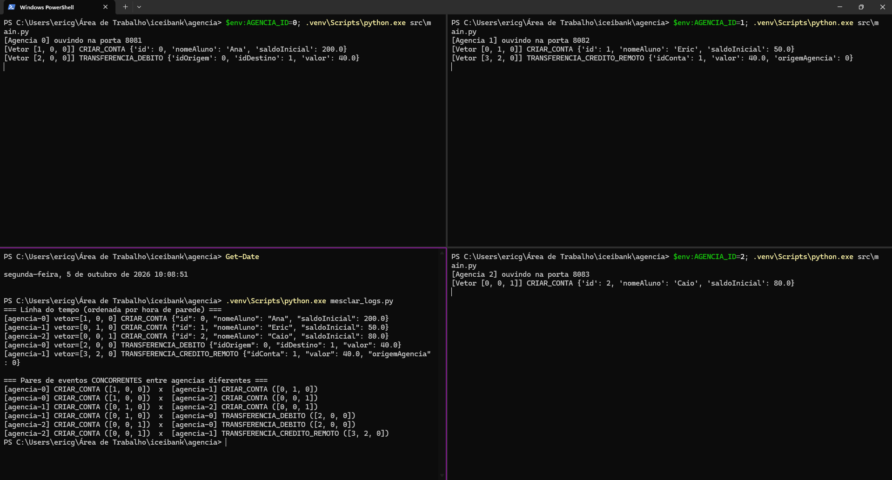

## Funcionalidade adicional (seção 2.1)

**Funcionalidade escolhida: idempotência no consumidor de créditos**

No Sprint 1 tornei a transferência idempotente na origem, para um clique duplo não debitar duas vezes. Com a mensageria apareceu o mesmo problema do outro lado. O RabbitMQ garante entrega "pelo menos uma vez": se a agência de destino processa a mensagem e cai antes de confirmar (o ack), o broker entrega a mesma mensagem de novo. Sem nenhuma proteção, a conta de destino recebia o crédito duas vezes, e o dinheiro aparecia do nada.

Escolhi essa porque fecha um furo real da troca de REST por mensageria, e porque continua a ideia que eu já tinha começado no Sprint 1.

**O que ela faz.** Cada mensagem de crédito passou a levar um `idMensagem`, gerado com `uuid4()` na hora da publicação. A agência de destino guarda os ids que já aplicou no `TransferenciasRepository`. Se chegar uma mensagem com um id repetido, ela não credita de novo e registra o evento `CREDITO_REMOTO_IGNORADO` no log.

O id só é guardado depois que o crédito é aplicado. Se a conta não existir, a mensagem não entra na lista, então uma nova entrega ainda pode ser aplicada se a conta for criada.

Mensagens sem `idMensagem`, como as que ficaram retidas na fila antes desta mudança, continuam sendo aplicadas normalmente.

**Teste.** Criei o script `agencia/testar_idempotencia.py`, que simula a falha do ack publicando a mesma mensagem de crédito duas vezes na fila da agência dona da conta.

PENDENTE: preencher com o resultado do teste no PC.

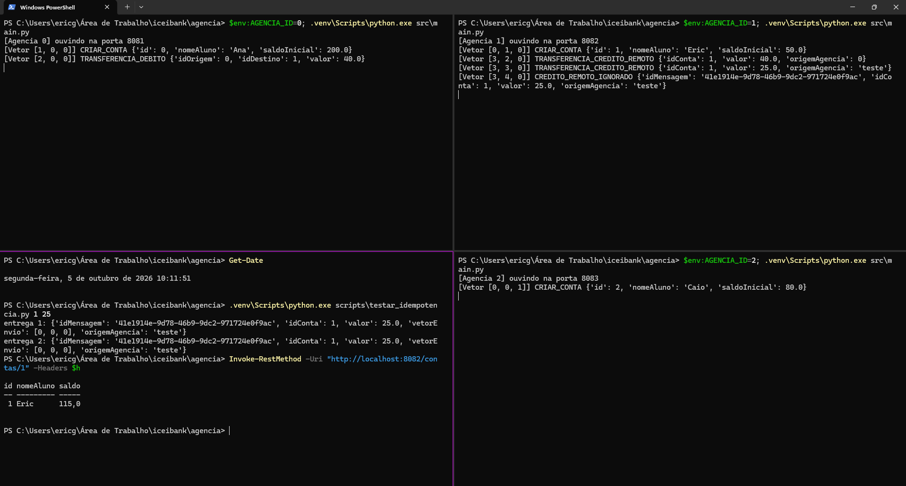

**Limite conhecido.** Igual ao Sprint 1, os ids ficam em memória e somem se a agência reiniciar.
